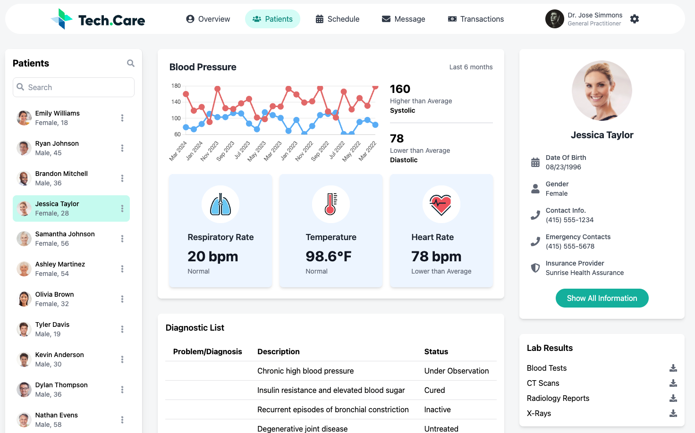

# 🏥 Healthcare Dashboard – Coalition Technologies Skills Test

## 📋 Overview

This is a single-page React application developed as part of the **Front End Developer Skills Test** for Coalition Technologies. The goal was to convert an [Adobe XD Template](https://xd.adobe.com/view/121254c9-532f-4772-a1ba-dfe529a96b39-4741/) into a responsive UI and fetch data via the Coalition Technologies API to populate the dashboard.

The application focuses on displaying information **only for patient Jessica Taylor**, including blood pressure graphs and detailed medical statistics.



---

## 🚀 Tech Stack

- **Frontend Framework**: [React](https://react.dev/) with [Vite](https://vitejs.dev/)
- **Styling**: [Tailwind CSS](https://tailwindcss.com/)
- **Charts**: [Chart.js](https://www.chartjs.org/) with [react-chartjs-2](https://github.com/reactchartjs/react-chartjs-2)
- **API Client**: [Axios](https://axios-http.com/)
- **Icons**: [Lucide](https://lucide.dev/), [React Icons](https://react-icons.github.io/react-icons/)
- **Linting**: ESLint

---

## 📁 Project Structure

```
src/
├── api/              # Axios API config
├── assets/           # Icons, logos, images
├── components/       # Reusable UI components
├── lib/              # Chart utilities, constants
├── page/             # Dashboard page (main view)
├── service/          # API request services
├── App.jsx           # Application wrapper
├── main.jsx          # App entry point
└── index.css         # Global styles
```

---

## ⚙️ Installation & Setup

### 1. Install Dependencies

```bash
npm install
```

### 2. Start the Development Server

```bash
npm run dev
```

Open http://localhost:5173 in your browser.

---

## 🧠 Best Practices Followed

- Semantic and accessible HTML structure
- Mobile responsive with Tailwind utilities
- Code split into modular, reusable components
- Source files (not minified) included for full review
- Design closely matches Adobe XD with pixel precision
- No extra time was spent on non-functional elements (search, dropdowns, ellipses, etc.)

---

## 📝 Notes

- This project does not use any third-party code or templates.
- All functionality was implemented from scratch based on the provided instructions.
- Code is not published publicly, as per assessment guidelines.

---

## 👤 Author

```bash
Umar Farooq
Software Engineer
📧 umer4361@gmail.com
```

Thank you for reviewing my project submission!
